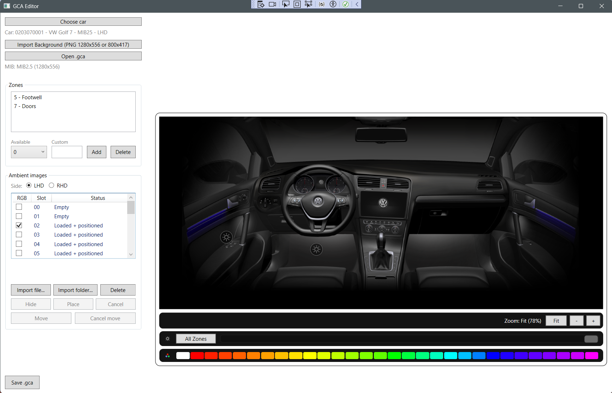

# GcaEditor

**GcaEditor** is a WPF tool for editing **Volkswagen ambient lighting layout files (`.gca`)** used by **MIB2 / MIB2.5 infotainment systems**.

The editor allows visualization and modification of ambient lighting layouts used in vehicle infotainment systems, including zone placement, feature images, brightness preview, and color simulation.

---

# Screenshot



---

# Features

## Vehicle layout editor

- Load `.gca` layout files
- Visualize ambient lighting zones ("suns")
- Add and delete zones
- Drag zones directly on the interior layout
- Zones automatically maintain the correct **104×104 size**

---

## Ambient feature editor

- Load ambient feature PNG images
- Drag feature images inside the vehicle layout
- Move features using keyboard arrows
- Fine positioning support
- Undo / redo support

---

## Ambient brightness preview

- Dedicated brightness slider
- Real-time ambient brightness preview
- **Per-zone brightness memory**
- **All Zones mode** for global brightness control

Behavior:
```
- All Zones ON → all suns deselected
- Click sun → All Zones OFF
- Click background → suns OFF + All Zones OFF
```

---

## Ambient color preview

Ambient lighting colors can be previewed using the integrated color palette.

- **30 selectable colors**
- White available as default color
- Gradient starting from red through the full spectrum
- Real-time preview of ambient lighting colors

---

## Per-feature RGB selection

Ambient features can be individually marked as RGB-enabled.

- Checkbox per feature
- Only RGB-enabled features respond to color changes
- Non-RGB features remain white

This allows accurate simulation of vehicles where only certain light strips support color control.

---

# Vehicle support

Vehicle layouts are loaded from the **Assets/Cars** directory.


Each vehicle contains:

- interior background images
- GCA layout files
- ambient feature PNG images

Supported brands currently include:

- Volkswagen
- Skoda
- Seat

---

# GCA file format

A `.gca` file describes the layout used by the ambient lighting interface.

The structure contains:
```
- Header
- Zones (interactive suns)
- Feature slots (ambient images)
```

Zones define where the user can interact with lighting areas.

Features represent the light strips or illuminated elements shown in the interior diagram.

The `.gca` file defines:

- zone coordinates
- feature positions
- zone → feature associations

Feature images themselves are stored separately as **PNG files**.

---

# Building the project

Requirements:

- **.NET 8**
- **Visual Studio 2022**

Clone the repository:
```
git clone https://github.com/djskual/GcaEditor.git
```

Open the solution in Visual Studio and build the project.

---

# Releases

Prebuilt binaries are available in the **Releases** section.

Download the latest release and run:
GcaEditor.exe


No installation required.

---

# Disclaimer

This project is intended for **research and development purposes only**.

It is not affiliated with or endorsed by **Volkswagen AG**.

Use at your own risk when modifying files used in vehicle systems.

---

# Contributing

Contributions and reverse-engineering insights are welcome.

Feel free to open issues or submit pull requests.

---

# Author

Created by **djskual**

Thanks to:

- Dachillout for original researches on .gca file format,
- Cuzoe for beta tests
- Meesters for beta tests
